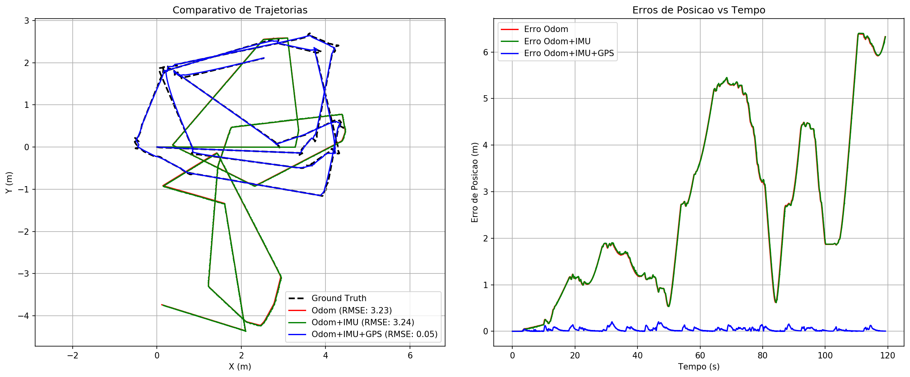

# Fusão Sensorial com Filtro de Kalman em ROS

Pacote ROS (Noetic) para comparação de três configurações de localização usando **Filtro de Kalman Estendido (EKF)** com o robô **Clearpath Husky** no simulador **Gazebo**.

## Descrição

Este pacote implementa e compara três configurações de fusão sensorial para localização do robô Husky:

| Configuração | Sensores | Arquivo de Config |
|---|---|---|
| **Apenas Odometria** | Encoders das rodas | `ekf_odom_only.yaml` |
| **Odometria + IMU** | Encoders + IMU | `ekf_odom_imu.yaml` |
| **Odometria + IMU + GPS** | Encoders + IMU + GPS | `ekf_odom_imu_gps.yaml` |

O pacote utiliza o nó `ekf_localization_node` do [robot_localization](http://wiki.ros.org/robot_localization) para implementar o filtro EKF.

## Estrutura do Pacote

```
atividade_2/
├── CMakeLists.txt                  # Build do pacote catkin
├── package.xml                     # Dependências do pacote
├── README.md                       # Este arquivo
├── config/
│   ├── ekf_odom_only.yaml          # Config EKF: apenas odometria
│   ├── ekf_odom_imu.yaml           # Config EKF: odometria + IMU
│   └── ekf_odom_imu_gps.yaml       # Config EKF: odometria + IMU + GPS
├── launch/
│   ├── simulation.launch           # Inicia Gazebo + Husky (sem EKF padrão)
│   ├── odom_only.launch            # Lança EKF com apenas odometria
│   ├── odom_imu.launch             # Lança EKF com odometria + IMU
│   ├── odom_imu_gps.launch         # Lança EKF com odometria + IMU + GPS
│   └── run_test.launch             # Launch mestre (seleciona config por arg)
├── scripts/
│   ├── gps_to_odom.py              # Conversão GPS (lat/lon) → odom (x/y)
│   ├── ground_truth_odom.py        # Ground truth do Gazebo → /gt/odom
│   ├── metrics_evaluator.py        # Cálculo de métricas em tempo real
│   ├── plot_results.py             # Geração de gráficos comparativos
│   └── run_all_tests.sh            # Script para execução automatizada
└── results/                        # Resultados gerados (CSVs + gráficos)
```

## Tópicos ROS

| Tópico | Tipo | Descrição |
|---|---|---|
| `/wheel/odom` | `nav_msgs/Odometry` | Odometria das rodas (relay de `husky_velocity_controller/odom`) |
| `/imu/data` | `sensor_msgs/Imu` | Dados da IMU |
| `/fix` | `sensor_msgs/NavSatFix` | GPS bruto (latitude/longitude) |
| `/gps/odom` | `nav_msgs/Odometry` | GPS convertido para coordenadas locais x/y |
| `/odometry/filtered` | `nav_msgs/Odometry` | Saída do EKF (pose estimada) |
| `/gt/odom` | `nav_msgs/Odometry` | Ground truth (apenas para avaliação) |

## Métricas Calculadas

O nó `metrics_evaluator.py` compara `/odometry/filtered` com `/gt/odom` e calcula:

- **Erro médio de posição** (m)
- **RMSE de posição** (m)
- **Erro máximo de posição** (m)
- **Erro final de posição** (m)
- **Erro médio de orientação** (graus)
- **Erro máximo de orientação** (graus)

## Como Executar

### Pré-requisitos

- Docker e Docker Compose instalados
- Repositório [lar_gazebo](https://github.com/lar-deeufba/lar_gazebo) clonado em `~/lar_gazebo`
- Este pacote clonado em `~/atividade_2`

### Passo 1: Configurar o Docker

O `docker-compose.yml` do `lar_gazebo` deve montar este pacote. Adicione o seguinte volume:

```yaml
volumes:
  - ${HOME}/atividade_2:/ws/src/atividade_2:rw
```

### Passo 2: Iniciar o container

```bash
cd ~/lar_gazebo
docker compose up -d
docker exec -it lar_gazebo_noetic bash
```

### Passo 3: Compilar o workspace (dentro do container)

```bash
cd /ws
catkin build atividade_2
source devel/setup.bash
```

### Passo 4: Iniciar a simulação (Terminal 1)

```bash
roslaunch atividade_2 simulation.launch
```

Isto lança o Gazebo com o Husky e o nó de ground truth. O EKF padrão do Husky é **desabilitado** automaticamente.

### Passo 5: Movimentar o robô (Terminal 2)

**Atenção:** Em toda nova aba de terminal, você deve entrar no container e carregar o ambiente do ROS! Use teleop ou publique comandos de velocidade:

```bash
docker exec -it lar_gazebo_noetic bash
source /ws/devel/setup.bash

# Teleop por teclado
rosrun teleop_twist_keyboard teleop_twist_keyboard.py

# Ou comando direto
rostopic pub -r 10 /cmd_vel geometry_msgs/Twist \
  "linear: {x: 0.5, y: 0.0, z: 0.0}" \
  "angular: {x: 0.0, y: 0.0, z: 0.3}"
```

### Passo 6: Executar um teste individual (Terminal 3)

**Nota:** *Este passo é opcional e serve apenas para depuração. Se você quer gerar o painel final com os três filtros, pule direto para o **Passo 7**.*

Se estiver abrindo uma nova aba:
```bash
docker exec -it lar_gazebo_noetic bash
source /ws/devel/setup.bash

# Teste com apenas odometria
roslaunch atividade_2 odom_only.launch

# Teste com odometria + IMU
roslaunch atividade_2 odom_imu.launch

# Teste com odometria + IMU + GPS
roslaunch atividade_2 odom_imu_gps.launch
```

### Passo 7: Executar todos os testes automaticamente

```bash
docker exec -it lar_gazebo_noetic bash
source /ws/devel/setup.bash

rosrun atividade_2 run_all_tests.sh 120
```

Isto executa as 3 configurações simultaneamente (por 120s) no mesmo trajeto enquanto você pilota o robô. Isso garante que a trajetória base (Ground Truth) seja exatamente a mesma para os 3 filtros, e ao final gera o painel comparativo automaticamente.

### Passo 8: Gerar gráficos manualmente

```bash
docker exec -it lar_gazebo_noetic bash
source /ws/devel/setup.bash

python3 $(rospack find atividade_2)/scripts/plot_results.py
```

## Gráficos Gerados

O script `plot_results.py` gera uma única imagem consolidada no diretório `results/`:

1. **`atividade_2_comparacao_plots.png`** — Painel com as trajetórias estimadas vs. ground truth e os erros de posição ao longo do tempo.



## Discussão dos Resultados

### Apenas Odometria
A odometria de rodas é a fonte mais básica de localização. Apresenta _drift_ acumulativo ao longo do tempo, especialmente em curvas, onde o escorregamento das rodas não é capturado pelos encoders.

### Odometria + IMU
A adição da IMU melhora a estimativa de orientação (yaw), pois o giroscópio fornece medições diretas de velocidade angular, compensando o _drift_ angular da odometria. O erro de posição também reduz, pois a orientação mais precisa resulta em melhor integração das velocidades.

### Odometria + IMU + GPS
A adição do GPS corrige o _drift_ de posição ao fornecer medições absolutas de posição. Esta é a configuração mais coerente, combinando:
- Alta frequência da odometria/IMU para estimativas suaves
- Correção global do GPS para limitar o erro acumulado

Espera-se que esta configuração apresente os menores erros de posição, especialmente em trajetórias longas.

## Autor

- **Nome:** Elias G. M. B. da Silva
- **Disciplina:** Tópicos Especiais em Engenharia Elétrica IV: Localização Robótica

## Licença

MIT License
